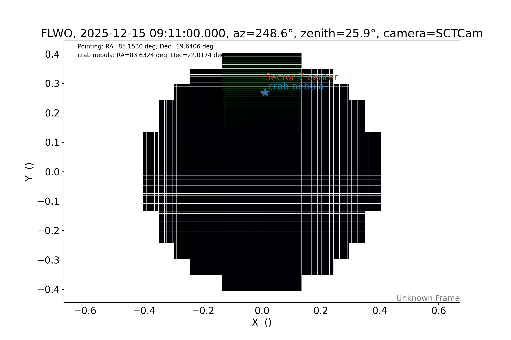

# pSCT Sector 7 Tracking Calculator

A small Python tool to compute **tracking coordinates** for pSCT observations such that a target source is centered on **Sector 7** at the **midpoint of the observing run**.

The project provides:

- a **Graphical User Interface (GUI)** (`tracking_gui.py`)
- a **Command Line Interface (CLI)** (`tracking_cli.py`)
- **calculations** done for both applications in seperate script (`tracking_math.py`)

Given:

- a source (from a predefined list or manually entered coordinates),
- an observation start time (UTC),
- and an observing run length,

the tool computes the **required telescope tracking coordinates** so that the source lands at the desired Sector 7 camera position at the middle of the run.

<p align="center">
  
</p>

## Requirements

This tool requires:

- [`ctapipe`](https://ctapipe.readthedocs.io/)
- [`astropy`](https://www.astropy.org/)

Installing `ctapipe` will also install `astropy`, so in practice you only need `ctapipe`.

---

## Instructions

To launch GUI run:
```
python tracking_gui.py
```
To launch CLI run:
```
python tracking_cli.py
```
---

## Contact
Author: Miguel Escobar Godoy

email: mescob11@ucsc.edu
